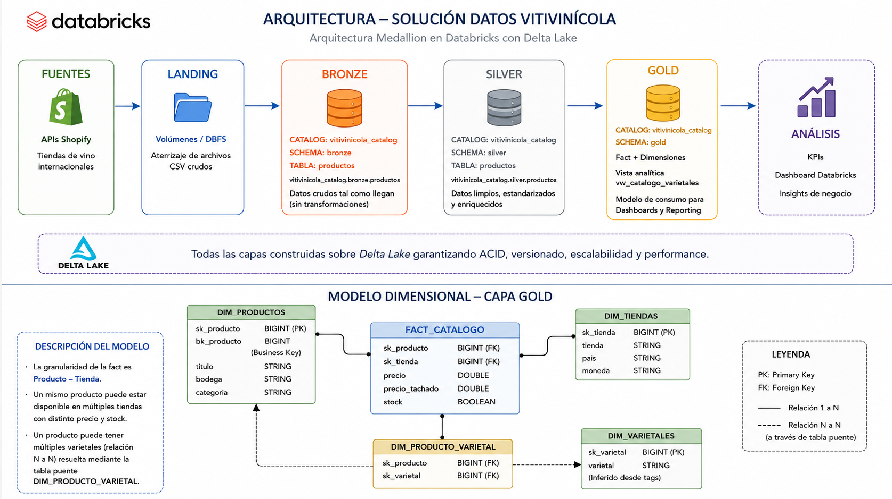
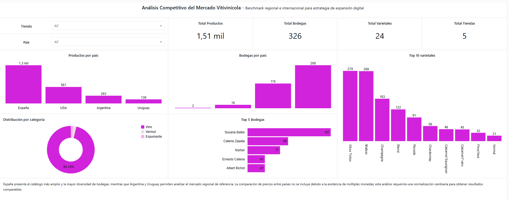

# Mercado Vitivinícola - Data Engineering Project

## Objetivo

Diseñar una plataforma analítica sobre Databricks para analizar el catálogo, la oferta y el posicionamiento competitivo de vinotecas digitales de Argentina, Uruguay, España y Estados Unidos, con el objetivo de apoyar decisiones de expansión comercial.

## Arquitectura

Arquitectura Lakehouse implementada en Databricks siguiendo el enfoque Medallion (Landing → Bronze → Silver → Gold), con un modelo dimensional en la capa Gold y una vista analítica (`vw_catalogo_varietales`) utilizada como capa de consumo para dashboards y consultas de negocio.

## Tecnologías

- Databricks
- Delta Lake
- SQL
- Python
- Git / GitHub
- Databricks SQL Dashboards

## Capas

### Landing

Zona de aterrizaje donde se almacenan los archivos CSV generados a partir de las APIs de Shopify antes de ser procesados por el pipeline.

### Bronze

Almacena los datos crudos provenientes de las distintas fuentes, preservando la información original para auditoría y trazabilidad.

### Silver

Aplica procesos de limpieza, estandarización, deduplicación y reglas de calidad de datos.

### Gold

Implementa el modelo dimensional compuesto por tablas de hechos y dimensiones. Sobre esta capa se construyó la vista analítica vw_catalogo_varietales, utilizada como capa de consumo para dashboards, KPIs y consultas de negocio.

## Modelo dimensional

- dim_tiendas
- dim_productos
- dim_varietales
- dim_producto_varietal
- fact_catalogo

## Principales desafíos

- Recuperación de categorías nulas mediante inferencia.
- Reclasificación de espumantes mal catalogados.
- Homologación de bodegas.
- Tratamiento de ruido en tags.
- Resolución de relaciones muchos a muchos.

## Dashboard

El dashboard fue desarrollado en Databricks SQL Dashboards y permite responder las siguientes preguntas de negocio:

- ¿Cuál es el tamaño y diversidad del mercado analizado?
- ¿Qué países ofrecen el mayor catálogo?
- ¿Qué países concentran la mayor cantidad de bodegas?
- ¿Qué varietales predominan en la oferta?
- ¿Cómo se distribuye el catálogo por categoría?

## Resultados

La solución desarrollada permite:

- integrar información proveniente de múltiples tiendas Shopify;
- estandarizar y enriquecer el catálogo mediante reglas de negocio;
- comparar la oferta entre distintos mercados;
- analizar categorías, bodegas y varietales de forma consistente;
- desacoplar el consumo analítico mediante una vista especializada para BI;
- disponibilizar la información mediante dashboards interactivos en Databricks SQL.

## Documentación Técnica

Disponible en Notion:
https://app.notion.com/p/An-lisis-Competitivo-del-Mercado-Vitivin-cola-39ba0863f9fb8010b4d7d25faebeb923
